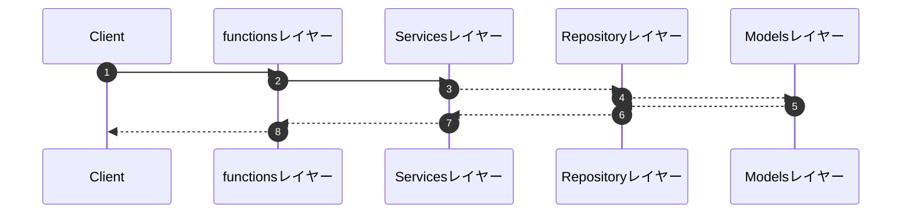
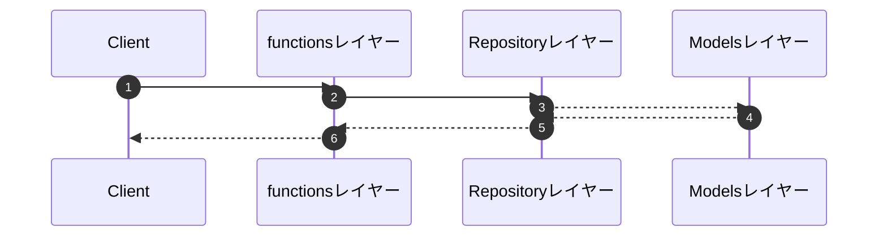

# 各レイヤーの説明
目的：責務を分けることで、保守性、可読性、テスト容易性を高めたい。
```
functions/ => Lambdaで実行されるエントリポイントとしてのコードを管理
models/ => SQLAlchemy用のコードを管理。基本的に1テーブルに1ファイル作成する。
repository/ => データベースへの更新処理や登録処理など、データベースとのやり取りを行うコード。
services/ => ビジネスロジックを管理。
```

## 依存関係図のイメージ
依存関係図で書くと、こんな感じに各レイヤーに依存するイメージ
(※ただし、functionレイヤーとserviceレイヤーでDB(TBL)に関するModelを知っているのはおかしいため、いずれ修正したい)
- [functions.userを起点とした依存関係図.png](/docs/about_dependencies/functions.userを起点とした依存関係図.png
)
- [/docs/about_dependencies/functions.userを起点とした依存関係図.png](/docs/about_dependencies/functions.userを起点とした依存関係図(型ヒント用のimportなしver).png)

## シーケンス図のイメージ
シーケンス図で書くとこんな感じに各レイヤーに処理を行うイメージ。


ビジネスロジックがほとんどない場合の処理イメージ。



# なぜこのような構成になったのか
[fastAPIのチュートリアル](https://fastapi.tiangolo.com/tutorial/sql-databases/)をベースに作り始めました。もう少しレイヤーを分けた方がきれいになるかもと思い、functionsレイヤーとmodelsレイヤーを作りました。  
テーブルの登録や更新処理はmodelsレイヤーできないのでは？と思い、modelsレイヤーとは別にrepositoryレイヤーを作りました。(この時点ではfunctions、repository、models)
ビジネスロジックを書いているときに、functionsレイヤーで書くとコードが見づらくなったので、ビジネスロジック用のレイヤーとしてservicesを追加しました。

ref: https://github.com/talasago/retro_app/pull/17#issuecomment-1646587072
